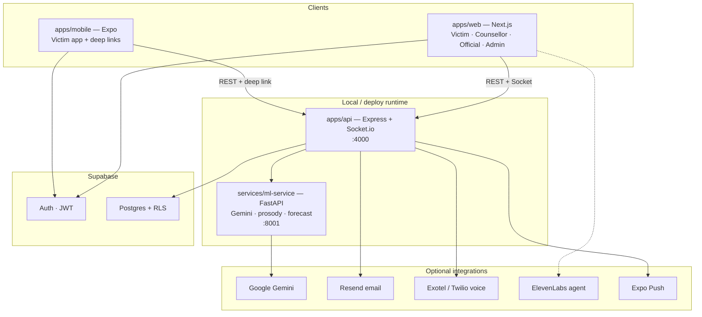
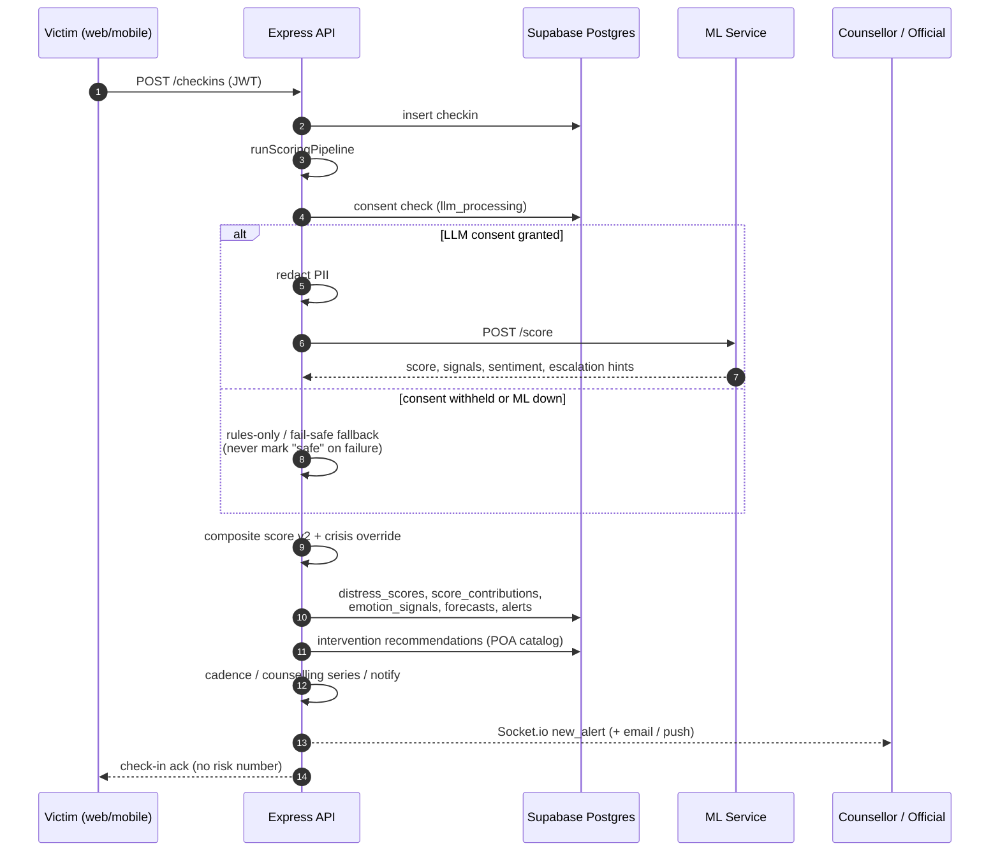
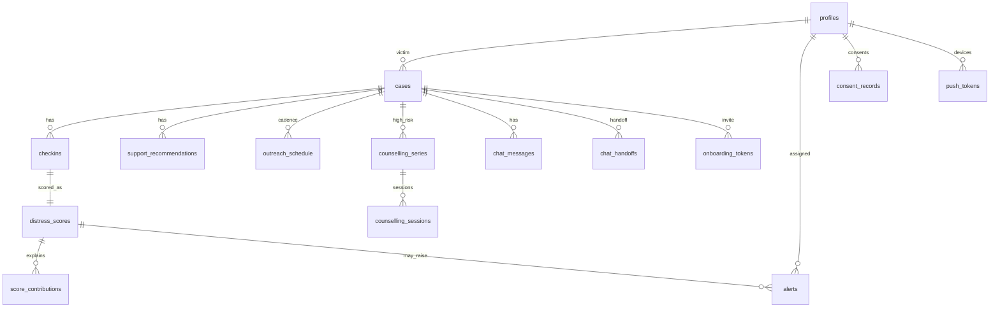

# Samvedna — Architecture

Detailed architecture of the **implemented** codebase. For the aspirational / target-state zone diagrams (Kafka, Fabric, federated learning, etc.), see [`docs/01-architecture.md`](docs/01-architecture.md). Capability honesty labels: **LIVE**, **ARCHITECTED**, **ROADMAP** — see [`docs/PRESENTATION.md`](docs/PRESENTATION.md) and the landing ledger.

> Decision support for authorised professionals — **not** an emergency service and **not** a clinical diagnosis.

---

## 1. Purpose and scope

Samvedna is an AI-assisted **dynamic mental health monitoring** platform for atrocity survivors and complainants under the **SC/ST (Prevention of Atrocities) Act, 1989**. It:

1. Collects check-ins across web, mobile, chat, and (optional) telephony.
2. Scores distress with a transparent composite + optional Gemini LLM path.
3. Escalates to counsellors / district / officials via Socket.io, email, and push.
4. Surfaces explainable case intelligence and POA-linked intervention recommendations.
5. Never shows risk scores to victims; humans remain the decision-makers.

---

## 2. System context



| Process | Package | Port | Role |
|---------|---------|------|------|
| Web portal | `@samvedna/web` | 3000 | Role-based UI |
| API | `@samvedna/api` | 4000 | Business logic, websockets, jobs |
| ML service | `@samvedna/ml-service` | 8001 | Score / chat / voice / forecast |
| Mobile | `@samvedna/mobile` | Expo | Victim client |
| Shared types | `@samvedna/shared-types` | — | Contracts for API ↔ clients |

`pnpm dev` starts web + api + ml together via `concurrently`.

---

## 3. Monorepo layout

```
SAMVEDNA/
├── apps/
│   ├── web/                 Next.js App Router portal
│   ├── api/                 Express API + Socket.io + cadence tick
│   └── mobile/              Expo (React Native) victim app
├── packages/
│   └── shared-types/        TypeScript enums, rows, API DTOs
├── services/
│   └── ml-service/          FastAPI: Gemini scoring, prosody, escalation model
├── supabase/
│   ├── migrations/          Ordered SQL schema evolution
│   └── seed.sql             Demo fixtures (also scripts/seed.ts)
├── scripts/                 seed, migrate-check, smoke-api, Android helpers
└── docs/                    Architecture, presentation, sprint plan
```

Workspace: `pnpm-workspace.yaml` includes `apps/*`, `packages/*`, `services/*`.

---

## 4. Role surfaces

| Role | Primary clients | Responsibilities |
|------|-----------------|------------------|
| **Victim** | Web `/victim/*`, Expo app | Check-in, Mann-Mitra chat, instant AI call, consultant booking, exercises, onboarding, consent |
| **Counsellor** | Web `/counselor/*` | Case queue, case intelligence, chat handoff, calls, acknowledge alerts |
| **Official** | Web `/official/*` | District/state dashboard filters, judiciary desk intake (simulated NHAA connector) |
| **Admin** | Web `/admin` | Users, assignments, national KPIs, audit verify |

Auth is **Supabase Auth** (email/password + Google OAuth). The API validates `Authorization: Bearer <jwt>` via `requireAuth` / `requireRole` in `apps/api/src/middleware/auth.ts`, then loads `profiles.role`.

---

## 5. Request and data flow (check-in → alert)

This is the core LIVE path.



### Pipeline modules (`apps/api/src/lib/`)

| Module | Job |
|--------|-----|
| `scoring-pipeline.ts` | Orchestrates the full path |
| `ml-client.ts` | Calls ML; PII redaction; consent gate; local fallback |
| `composite-score.ts` | Weighted 5-channel score; crisis override; contribution identity |
| `distress-intelligence.ts` | Trends, risk bands, longitudinal helpers |
| `engagement.ts` | Behavioural / silence signals |
| `intervention-engine.ts` | POA catalogue matching + persistence |
| `cadence-engine.ts` | Outreach schedule tick (every 60s) |
| `counselling-series.ts` | Auto daily sessions for high/critical |
| `notify-risk.ts` / `notify-sla.ts` | Email (+ socket) risk and SLA breach |
| `playbooks.ts` / `bail-playbook.ts` | Case-type and simulated bail-event playbooks |
| `chat-handoff-state.ts` | AI → human chat handoff rooms |
| `push.ts` | Expo push via `push_tokens` |
| `email.ts` | Resend or `email_outbox` demo log |
| `consent.ts` / `audit.ts` / `redact.ts` | DPDP-oriented gates and hash-chained audit |

### Composite score (LIVE)

Five channels with weight redistribution when a channel is missing (`COMPOSITE_VERSION = v2.0`):

| Channel | Base weight | Evidence |
|---------|-------------|---------|
| Clinical | 0.30 | Screening instruments when present |
| Text sentiment | 0.25 | LLM / rules on transcript |
| Vocal stress | 0.20 | Prosody / voice analysis |
| Behavioural | 0.15 | Engagement, silence, missed outreach |
| Case context | 0.10 | Stage, days open, judiciary context |

Invariant:

```text
score = COMPOSITE_BASE(50) + Σ score_contributions[].contribution
```

Counsellor UI explains via the **same arithmetic** (waterfall), not a second rationalising model. Crisis language / C-SSRS-style screens / active threat patterns can override to critical without requiring corroboration.

---

## 6. API surface

Mount points from `apps/api/src/index.ts`:

| Prefix | Domain |
|--------|--------|
| `GET /health` | Liveness |
| `/checkins` | Check-in create + scoring |
| `/chat` | Mann-Mitra + handoff |
| `/calls`, `/webhooks` | Voice sessions / provider webhooks |
| `/victim/*` | Dashboard, mobile, instant calls, consultant, exercises, profile, onboarding |
| `/judiciary` | Desk intake / simulated judiciary signals |
| `/cases` | Cases + intelligence + explain |
| `/alerts` | Alert lifecycle |
| `/dashboard` | Aggregates for official/admin |
| `/admin` | Admin operations |
| `/intake`, `/outreach` | Intake tokens, cadence outreach |
| `/audit`, `/consent` | Audit verify, granular consent |

### Real-time rooms (Socket.io)

Clients join:

- `user:{userId}` — personal alerts / assignments  
- `case:{caseId}` — case-scoped events  
- `handoff:{handoffId}` — live counsellor chat handoff  

Emitted events include `new_alert` and related case updates. CORS origins come from `SOCKET_CORS_ORIGIN` (defaults: localhost 3000–3002).

### Background tick

On listen, `startCadenceTick(io, 60_000)` processes due / missed outreach and related care cadence work.

---

## 7. ML service

`services/ml-service/main.py` (FastAPI):

| Endpoint | Purpose |
|----------|---------|
| `GET /health` | Health |
| `POST /score` | Gemini structured distress + signals |
| `POST /explain` | Explanation assist |
| `POST /score-voice` | Voice note → prosody features (librosa) |
| `POST /forecast` | Trajectory / cone inputs |
| `POST /escalation` | sklearn escalation model (synthetic-trained) |
| `POST /chat` | Mann-Mitra conversational turn |

Honesty constraints baked into product copy and code:

- Escalation / forecast models are **backtested on synthetic longitudinal data** until prospectively validated.
- Voice personal baseline requires **≥3 samples**; otherwise population norms.
- If Gemini is down, API rules fallback **flags for human review** — it does not silently clear risk.

---

## 8. Data model (Postgres)

Schema evolves via ordered migrations under `supabase/migrations/`. Core entities:



Notable tables (non-exhaustive):

| Area | Tables |
|------|--------|
| Core | `profiles`, `cases`, `checkins`, `distress_scores`, `alerts`, `support_recommendations`, `case_timeline_events`, `intervention_notes` |
| Intelligence | `score_contributions`, `engagement_metrics`, `clinical_assessments`, `voice_analyses`, `voice_baselines`, `distress_forecasts`, `emotion_signals`, `escalation_forecasts` |
| Care ops | `outreach_schedule`, `counselling_series`, `counselling_sessions`, `intervention_catalog`, `district_registry` |
| Victim UX | `instant_calls`, `consultants`, `consultant_*`, `chat_messages`, `chat_handoffs`, `exercise_recommendations`, `victim_onboarding_responses` |
| Trust | `consent_records`, `audit_log`, `email_outbox`, `push_tokens`, `onboarding_tokens` |
| Voice | `call_sessions` (+ Exotel/Twilio sid columns) |

RLS policies exist for client-side Supabase access; the API primarily uses the **service role** for server writes after JWT authZ checks.

---

## 9. Web application architecture

Next.js App Router under `apps/web/src/app/`:

| Area | Routes |
|------|--------|
| Public | `/`, `/login`, `/signup`, `/onboard/[token]`, `/brand` |
| Victim | `/victim/dashboard`, `checkin`, `chatbot`, `call`, `consultant`, `exercises`, `onboarding`, … |
| Counsellor | `/counselor/cases`, `cases/[id]`, `calls`, `chat/[id]` |
| Official | `/official/dashboard`, `intake` |
| Admin | `/admin` |

Shared concerns:

- Supabase browser/server clients + middleware session refresh  
- Socket client (`src/lib/socket.ts`) for live alerts  
- Shells: `app-shell`, `counsellor-shell`  
- Intelligence UI: living chart, forecast cone, gone-quiet rail, ops intelligence, contribution waterfall  

Victims never render numeric risk; counsellor/admin surfaces show scores with honesty footnotes.

---

## 10. Mobile architecture

Expo app (`apps/mobile`):

- Auth via Supabase + SecureStore  
- Scheme `samvedna://` — deep link `samvedna://onboard/[token]`  
- Tabs: home (next counselling session / join), call modes  
- Push token registration → API `push_tokens`  
- Offline-friendly patterns for check-in queue (see mobile helpers)  
- EAS build profiles in `eas.json`

API companion routes live under `/victim` (`victim-mobile.ts`) for mobile-specific payloads.

---

## 11. Security, privacy, compliance (implemented subset)

| Control | Implementation |
|---------|----------------|
| AuthN | Supabase JWT on API |
| AuthZ | Role gates + case-access helpers |
| Consent | Granular `consent_records`; `llm_processing` skips Gemini |
| PII | `redact.ts` before ML; redaction count exposed for demos |
| Transport | HTTPS in deploy; Helmet + CORS on API |
| Audit | Append-style `audit_log` with verify endpoint |
| Fail-safe | ML outage → review flag, not “low risk” |
| Human gate | Alerts notify people; no autonomous adverse case action |

Still **ARCHITECTED / ROADMAP** relative to `docs/01-architecture.md`: Hyperledger consent ledger, HSM key custody, federated training, state-local raw audio zoning, full SIEM/UEBA.

---

## 12. Integrations matrix

| Integration | Status | Notes |
|-------------|--------|-------|
| Supabase Auth + Postgres | LIVE | Source of truth |
| Google Gemini | LIVE | Scoring + chat when consented |
| Socket.io | LIVE | Alerts / handoff |
| Resend | LIVE (optional) | Else `email_outbox` logged |
| Expo Push | LIVE (device) | Simulators skip |
| ElevenLabs agent | LIVE (client) | Instant call UX |
| Exotel / Twilio | LIVE when configured | Webhooks need public base URL |
| NHAA / e-Courts / CCTNS | Simulated / ARCHITECTED | Desk intake labelled; never claimed as live gov API |
| Bail / judiciary feed | Simulated playbook | `bail-playbook.ts` |

---

## 13. Key product flows

### A. Judiciary desk → victim onboard

1. Official creates intake (`/official/intake` → `/judiciary` / `/intake`).  
2. `onboarding_tokens` issued.  
3. Victim opens web `/onboard/[token]` or mobile `samvedna://onboard/...`.  
4. Light onboard responses stored; case linked; counsellor allotment may run.

### B. High / critical → counselling series

Scoring pipeline + `counselling-series` schedule daily ~1h sessions; reminders via email/push; mobile home shows next session + join.

### C. Chat handoff

Victim chats with Mann-Mitra → distress / request triggers `chat_handoffs` → counsellor accepts in `/counselor/chat/[id]` over Socket room `handoff:*`.

### D. Gone quiet / outreach cadence

`outreach_schedule` + cadence tick escalate silent cases into counsellor “Gone Quiet” rail and optional automated outreach channels when configured.

### E. SLA on interventions

Recommendations carry authority + SLA; `notify-sla` emails on breach; admin dashboard surfaces breaches.

---

## 14. Deployment topology (current)

**Development:** three local processes + hosted Supabase.

```text
Browser / Expo  →  localhost:3000 (web)
                →  localhost:4000 (API + Socket)
API             →  localhost:8001 (ML)
API / Web / ML  →  Supabase cloud (Auth + Postgres)
```

**Production-shaped (typical):**

- Web → Vercel (or similar)  
- API + Socket → long-lived Node host (Socket needs sticky / dedicated process)  
- ML → Python service with `GEMINI_API_KEY`  
- Secrets via env (see `.env.example`) — never commit `.env`

Migrations must be applied in timestamp order on the remote Supabase project (through `20260905000008_push_tokens.sql` for current sprint features).

---

## 15. Design principles (as coded)

1. **Honesty over theatre** — LIVE vs ARCHITECTED labels; no fake gov APIs.  
2. **Explain with the same math** — contributions sum to the score.  
3. **Fail toward humans** — outages and low confidence escalate, not clear.  
4. **Consent is runtime** — LLM path is skippable per person.  
5. **Victims see care, not scores** — numbers stay on professional surfaces.  
6. **Channel-agnostic core** — check-ins carry a `channel` enum; scoring is shared.  
7. **POA literacy** — interventions cite statutory hooks, not generic “self-care” only.

---

## 16. Related documents

| Doc | Contents |
|-----|----------|
| [`docs/01-architecture.md`](docs/01-architecture.md) | Target-state swimlane architecture |
| [`docs/PRESENTATION.md`](docs/PRESENTATION.md) | Demo script + Q&A honesty |
| [`docs/SPRINT_PLAN.md`](docs/SPRINT_PLAN.md) | Sprint delivery checklist |
| [`README.md`](README.md) | Setup, accounts, env vars |
| [`docs/MASTER_PROMPT.md`](docs/MASTER_PROMPT.md) | Product / agent framing |

---

*Last aligned with the monorepo layout and Sprint 1–4 features (judiciary intake, email/push alerts, counselling series, escalation model, voice baseline, bail playbook, mobile onboard + push).*
