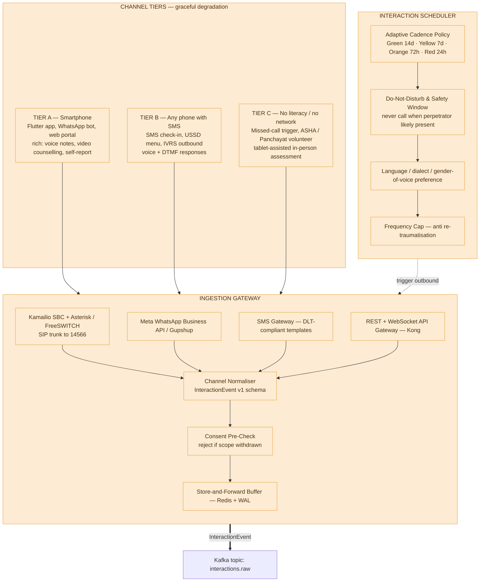
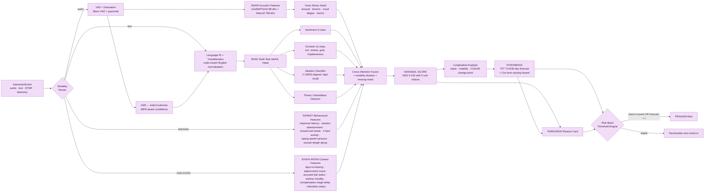
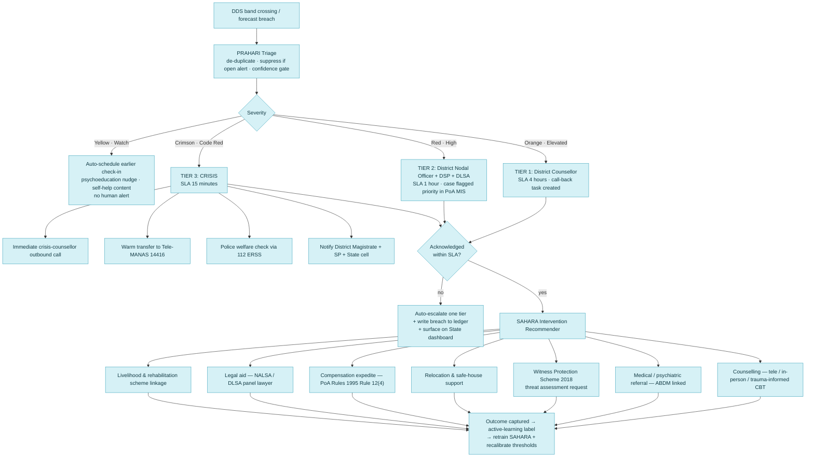
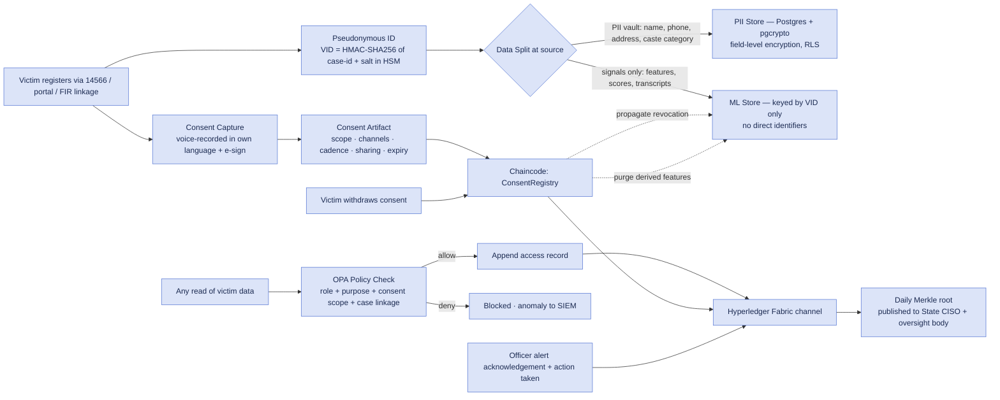
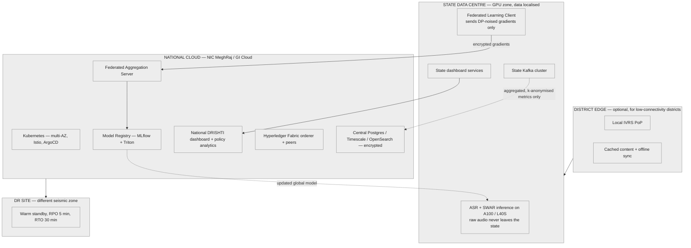
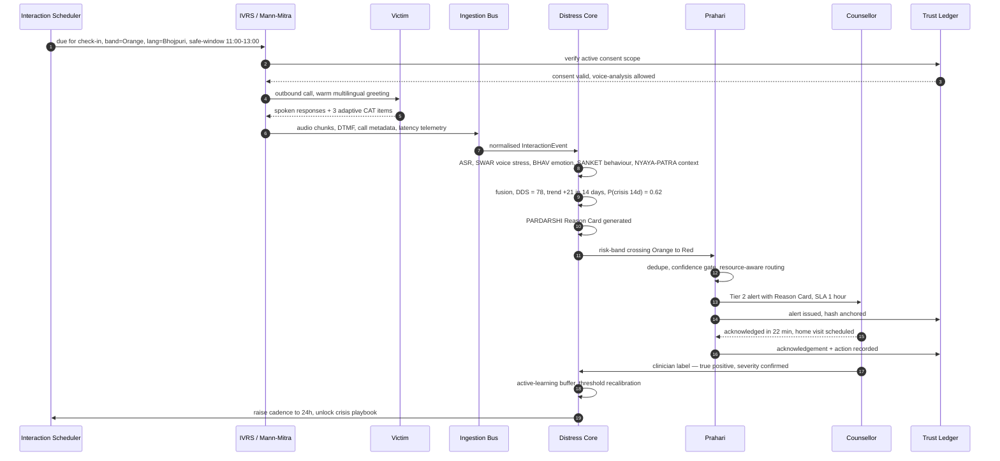
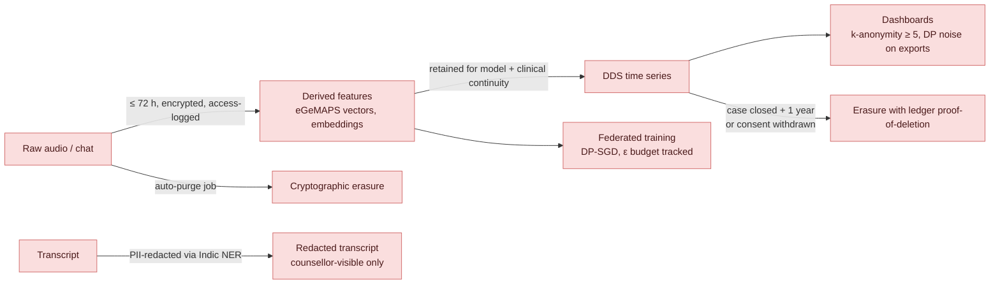

# SAMVEDNA — System Architecture

This document reproduces the layered, colour-coded, swimlane-style architecture of your reference diagram, mapped onto the mental-health monitoring problem. Diagram 0 is the **master architecture** (the direct analogue of the picture: coloured functional zones on the left/centre, a vertical **Security & Compliance rail** on the right, dashed control/audit flows crossing zones). Diagrams 1–7 zoom into each zone.

All diagrams are Mermaid — they render in Cursor/GitHub/Notion, and can be pasted into [mermaid.live](https://mermaid.live) to export SVG/PNG for a slide deck, or imported into draw.io via *Arrange → Insert → Advanced → Mermaid*.

---

## Zone legend (matches the reference diagram's colour language)

| Zone | Colour | Name | Role |
|---|---|---|---|
| ① | Orange | **Omnichannel Engagement Layer** | How we reach the victim — IVRS, SMS, WhatsApp, app, portal, field worker |
| ② | Green | **Victim Experience & Edge Layer** | Mobile/web clients, on-device inference, consent, panic, offline buffer |
| ③ | Purple | **AI Distress Intelligence Core** | ASR, NLP, voice stress, behavioural mining, fusion, DDS, forecasting, XAI |
| ④ | Blue | **Identity, Consent & Trust Ledger** | Pseudonymous ID, consent artifacts, permissioned ledger, encrypted vault |
| ⑤ | Cyan | **Command, Care & Governance Layer** | Counsellor console, district/state/national dashboards, govt integrations |
| ⑥ | Red | **Security, Privacy & Compliance Rail** | Crypto, SIEM, DPDP, RBAC, audit, retention, ethics — cross-cuts every zone |

---

## Diagram 0 — MASTER ARCHITECTURE

```mermaid
flowchart LR

%% ─────────────────────────── ZONE 1: OMNICHANNEL ENGAGEMENT ───────────────────────────
subgraph Z1["① OMNICHANNEL ENGAGEMENT LAYER"]
  direction TB
  N1["NHAA 14566 Helpline<br/>+ IVRS Outbound Campaign"]
  N2["SMS / USSD / Missed-Call<br/>for feature phones"]
  N3["WhatsApp / Telegram / RCS<br/>Chatbot"]
  N4["Field Counsellor Tablet<br/>offline-first"]
  N5["Asterisk / FreeSWITCH<br/>Telephony Gateway + SBC"]
  N6["Channel Normaliser<br/>one schema for all channels"]
  N7["Store-and-Forward Buffer<br/>network loss / 2G areas"]

  N1 -- "voice call audio 8 kHz" --> N5
  N2 -- "short text responses" --> N6
  N3 -- "chat turns + voice notes" --> N6
  N4 -- "in-person assessment" --> N7
  N5 -- "RTP stream + call metadata" --> N6
  N7 -- "sync on reconnect" --> N6
end

%% ─────────────────────────── ZONE 2: VICTIM EXPERIENCE / EDGE ───────────────────────────
subgraph Z2["② VICTIM EXPERIENCE & EDGE LAYER"]
  direction TB
  M1["Flutter Mobile App<br/>Victim + Counsellor builds"]
  M2["Next.js Integrated Web Portal"]
  M3["On-Device TFLite Pre-Screen<br/>tone + typing dynamics"]
  M4["Consent & Preference Manager<br/>DPDP consent artifact"]
  M5["Panic Button + Duress Safe-Word"]
  M6["Stealth Mode UI<br/>disguised app skin"]
  M7["Offline SQLite Queue<br/>encrypted at rest"]

  M1 --> M3
  M1 --> M4
  M1 --> M5
  M1 --> M6
  M1 --> M7
  M2 --> M4
end

%% ─────────────────────────── ZONE 3: AI DISTRESS INTELLIGENCE CORE ───────────────────────────
subgraph Z3["③ AI DISTRESS INTELLIGENCE CORE"]
  direction TB

  K1["Kafka / Redpanda<br/>Event Backbone"]
  K2["Flink Streaming<br/>Feature Computation"]
  K3["Feast Feature Store<br/>online + offline"]

  subgraph Z3A["MANN-MITRA · Conversational AI"]
    C1["Dialogue Orchestrator<br/>LangGraph + Rasa"]
    C2["Adaptive Instrument Engine<br/>PHQ-9 / GAD-7 / PSS-10 / C-SSRS via CAT"]
    C3["Indic TTS + Barge-in"]
  end

  subgraph Z3B["MULTIMODAL PERCEPTION"]
    P1["ASR — IndicConformer / IndicWhisper<br/>22 languages + code-mixed"]
    P2["SWAR — Voice Stress Analytics<br/>eGeMAPS + WavLM embeddings"]
    P3["BHAV — Indic NLP<br/>MuRIL: sentiment, emotion, ideation, threat"]
    P4["SANKET — Behavioural Signals<br/>latency, drop-off, missed calls, sleep-hour usage"]
    P5["NYAYA-PATRA — Case Context<br/>hearings, bail, adjournments, compensation delay"]
  end

  subgraph Z3C["FUSION · SCORING · FORECAST"]
    F1["Cross-Attention Multimodal Fusion<br/>modality-dropout robust"]
    F2["MANOBAL SCORE Engine<br/>Dynamic Distress Score 0-100"]
    F3["Longitudinal Analyser<br/>trend slope, volatility, CUSUM change-point"]
    F4["PURVABHAS Forecaster<br/>TFT + Cox survival: P crisis in 7/14/30 days"]
    F5["PARDARSHI XAI<br/>SHAP + attention + counterfactual Reason Card"]
  end

  T1["Threshold & Risk-Band Engine<br/>+ alert-fatigue damping"]

  K1 --> K2 --> K3
  K3 --> P2 & P3 & P4 & P5
  C1 --> C2 --> C3
  C1 -- "transcribed turns" --> P1
  P1 --> P3
  P2 --> F1
  P3 --> F1
  P4 --> F1
  P5 --> F1
  F1 --> F2 --> F3 --> F4
  F2 --> F5
  F4 --> F5
  F4 --> T1
  F2 --> T1
end

%% ─────────────────────────── ZONE 4: IDENTITY, CONSENT & TRUST LEDGER ───────────────────────────
subgraph Z4["④ IDENTITY, CONSENT & TRUST LEDGER"]
  direction TB
  B1["Keycloak OIDC<br/>victim, counsellor, officer realms"]
  B2["Pseudonymous Victim ID<br/>salted hash, no PII in ML store"]
  B3["Hyperledger Fabric<br/>permissioned, Raft ordering"]
  B4["Chaincode: Consent Artifact<br/>grant / scope / withdraw"]
  B5["Chaincode: Alert Acknowledgement SLA<br/>who saw it, when, what was done"]
  B6["Encrypted Vault<br/>MinIO + envelope encryption"]
  B7["Merkle Audit Root<br/>daily anchoring"]

  B1 --> B2
  B2 --> B3
  B3 --> B4
  B3 --> B5
  B4 --> B7
  B5 --> B7
  B2 --> B6
end

%% ─────────────────────────── ZONE 5: COMMAND, CARE & GOVERNANCE ───────────────────────────
subgraph Z5["⑤ COMMAND, CARE & GOVERNANCE LAYER"]
  direction TB
  D1["PRAHARI — Alert & Escalation Orchestrator<br/>Tier 1 / Tier 2 / Code Red"]
  D2["SAHARA — Intervention Recommender<br/>contextual bandit + statutory rule overlay"]
  D3["Counsellor Console<br/>DDS trend, transcript, Reason Card, safety plan"]
  D4["DRISHTI District Dashboard<br/>prioritised queue, heatmap, SLA breach"]
  D5["DRISHTI State Dashboard<br/>hotspots, scheme efficacy, caseload"]
  D6["DRISHTI National Dashboard<br/>policy analytics, cohort outcomes, digital twin"]
  D7["Notification Fabric<br/>SMS, WhatsApp, push, auto-dial, email"]
  D8["Govt System Connectors<br/>CCTNS/ICJS, e-Courts, PoA MIS, NALSA, Tele-MANAS, PFMS, 112 ERSS"]
  D9["OpenSearch + ELK<br/>traceability & case audit trail"]

  D1 --> D2
  D1 --> D7
  D2 --> D3
  D3 --> D4 --> D5 --> D6
  D8 --> D4
  D1 --> D9
end

%% ─────────────────────────── ZONE 6: SECURITY & COMPLIANCE RAIL ───────────────────────────
subgraph Z6["⑥ SECURITY, PRIVACY & COMPLIANCE RAIL — KAVACH"]
  direction TB
  S1["DPDP Act 2023<br/>consent, purpose limitation, erasure"]
  S2["AES-256-GCM at rest<br/>TLS 1.3 in transit"]
  S3["HashiCorp Vault + HSM<br/>key custody, field-level crypto"]
  S4["OPA / ABAC<br/>purpose-bound, break-glass logged"]
  S5["SIEM — Wazuh / Splunk<br/>UEBA on official access"]
  S6["Differential Privacy<br/>+ k-anonymity on dashboards"]
  S7["Retention Engine<br/>raw audio purged after 72 h"]
  S8["Bias & Fairness Monitor<br/>subgroup metrics, model cards"]
  S9["Human-in-the-Loop Gate<br/>no automated adverse decision"]
end

%% ─────────────────────────── PRIMARY DATA FLOWS ───────────────────────────
Z1 == "normalised interaction events" ==> K1
Z2 == "app telemetry, self-reports, panic" ==> K1
C3 -. "outbound check-in call / message" .-> Z1
D7 -. "schedules next interaction" .-> Z1
T1 == "risk-band crossing event" ==> D1
D2 == "recommended intervention set" ==> D7
Z4 -. "identity resolution + consent check" .-> K1
Z4 -. "consent scope gate" .-> Z3
D1 -. "write acknowledgement to ledger" .-> B5
Z5 -. "verify audit trail" .-> B7

%% ─────────────────────────── CROSS-CUTTING COMPLIANCE (dashed, like the reference) ───────────────────────────
Z6 -. "encrypt at rest and in transit" .-> Z1
Z6 -. "consent gate + purpose binding" .-> Z2
Z6 -. "DP noise, feature-only retention" .-> Z3
Z6 -. "key custody + ledger anchoring" .-> Z4
Z6 -. "RBAC, UEBA, k-anonymity" .-> Z5

%% ─────────────────────────── STYLES ───────────────────────────
classDef zone1 fill:#FDEBD3,stroke:#E8A33D,stroke-width:1px,color:#4A3212
classDef zone2 fill:#DFF3E2,stroke:#4FA463,stroke-width:1px,color:#1E3E27
classDef zone3 fill:#F1DDF7,stroke:#A45FC0,stroke-width:1px,color:#3D1B4A
classDef zone4 fill:#DCE4F8,stroke:#5B7BD5,stroke-width:1px,color:#1C2B52
classDef zone5 fill:#D6F1F6,stroke:#3FA5BC,stroke-width:1px,color:#123A44
classDef zone6 fill:#FADEDE,stroke:#D06565,stroke-width:1px,color:#4A1A1A

class Z1,N1,N2,N3,N4,N5,N6,N7 zone1
class Z2,M1,M2,M3,M4,M5,M6,M7 zone2
class Z3,Z3A,Z3B,Z3C,K1,K2,K3,C1,C2,C3,P1,P2,P3,P4,P5,F1,F2,F3,F4,F5,T1 zone3
class Z4,B1,B2,B3,B4,B5,B6,B7 zone4
class Z5,D1,D2,D3,D4,D5,D6,D7,D8,D9 zone5
class Z6,S1,S2,S3,S4,S5,S6,S7,S8,S9 zone6
```

---

## Diagram 1 — ① Omnichannel Engagement Layer (detail)

The hardest constraint in this problem is that a large share of beneficiaries under the SC/ST (PoA) Act are rural, low-literacy, and on feature phones. The channel strategy must degrade gracefully all the way down to a **missed call**.

---

## Diagram 2 — ③ AI Distress Intelligence Core (detail pipeline)

---

## Diagram 3 — Alert escalation & intervention (Zone ⑤ detail)

---

## Diagram 4 — ④ Consent, identity & tamper-evident audit

---

## Diagram 5 — Deployment topology

---

## Diagram 6 — End-to-end sequence of a single check-in

---

## Diagram 7 — Data lifecycle & retention

---

## Architectural principles (the "why" behind the shape)

1. **Channel-agnostic core.** Every channel collapses into one `InteractionEvent` schema before it touches intelligence. Adding a new channel (RCS, a kiosk, a Panchayat volunteer app) is a connector, not a redesign.
2. **Signals over answers.** The system must work even when the victim says nothing. Passive engagement telemetry is a first-class input, not a fallback.
3. **Data gravity is local.** Raw audio and PII stay in the state; only DP-noised gradients and k-anonymised aggregates travel to the national tier. This is both a privacy control and a bandwidth control.
4. **Every score is a claim that must be defended.** No alert leaves the system without a Reason Card. If we cannot explain it, we do not fire it.
5. **Consent is a runtime object, not a checkbox at signup.** Scope is evaluated on every read, and revocation propagates to derived features.
6. **The human is the decision-maker.** The AI ranks, explains and reminds. It never denies, closes, or downgrades a case on its own.
7. **Fail safe, not silent.** Missing modality, low ASR confidence, or a model timeout must bias the system toward *escalating to a human*, never toward marking the victim as fine.
